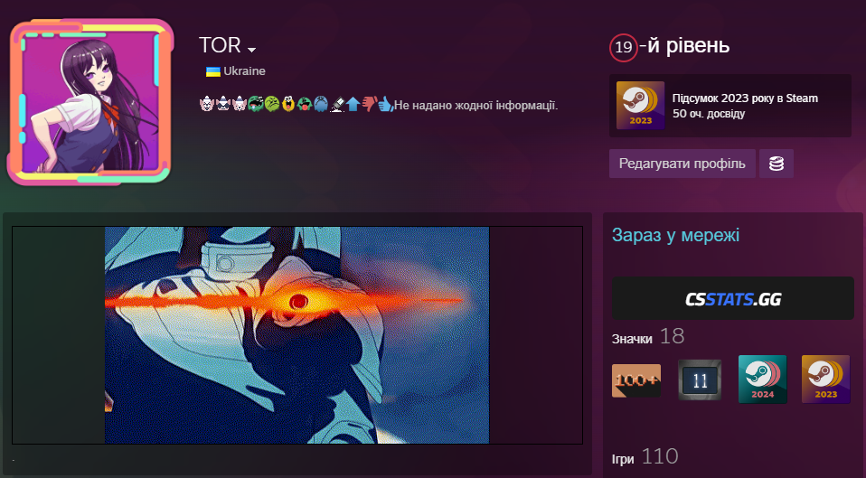
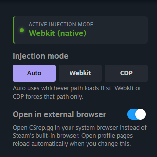

# CSStats.gg Extension for Millennium

A Millennium plugin that integrates CSStats.gg data and functionality directly into the Steam client, providing enhanced Counter-Strike statistics and profile information.

## Prerequisites

Before installing this plugin, ensure you have:

-   **[Millennium](https://steambrew.app/)** installed and configured

### Example




### Millennium Library Manager


---

## Installation Guide

### Method 1: Millennium Plugin Installer (Recommended)

1. **Copy Plugin ID**

    Copy the following [Plugin ID](https://steambrew.app/plugin?id=5a3b3a83840f)

2. **Install via Millennium**

    - Open Steam with Millennium installed
    - Go to **Millennium** → **Plugins**
    - Click on the **Install a plugin**
    - Paste the [Plugin ID](https://steambrew.app/plugin?id=5a3b3a83840f) into the installer
    - Click **Install**
    - Restart Steam when prompted

### Method 2: Build from Source

#### Step 1: Clone the Repository

```bash
git clone https://github.com/TOR968/csstats-extension.git
cd csstats-extension
```

#### Step 2: Install Dependencies

```bash
bun install
```

#### Step 3: Build the Plugin

**For development:**

```bash
bun run dev
```

**For production:**

```bash
bun run build
```

#### Step 4: Install to Steam

**Option A: Copy to plugins directory**

```bash
# Windows
copy /R . "C:\Program Files (x86)\Steam\plugins\csstats-extension"

# Linux
cp -r . ~/.local/share/millennium/plugins/csstats-extension

# macOS
cp -r . ~/Library/Application\ Support/millennium/plugins/csstats-extension
```

**Option B: Create symbolic link (for development)**

```bash
# Windows (run as Administrator)
mklink /D "C:\Program Files (x86)\Steam\plugins\csstats-extension" "%CD%"

# Linux/macOS
ln -s "$(pwd)" ~/.local/share/millennium/plugins/csstats-extension
```

#### Step 5: Enable Plugin in Steam

1. Completely close Steam (including system tray)
2. Restart Steam
3. Go to **Millennium** → **Plugins**
4. Enable "CSStats.gg Extension"
5. Restart Steam once more

---

## How it works

The webkit bundle ([webkit/index.tsx](webkit/index.tsx)) runs inside the Steam community
browser and injects the CSStats.gg button with a small vanilla-DOM function
(`csstatsInjectMain` in [webkit/inject.ts](webkit/inject.ts)). Settings are stored by a
small Lua backend ([backend/main.lua](backend/main.lua)) and edited from the plugin's
settings panel in the Steam client.

The backend resolves its own directory via Millennium's `utils` Lua module
(`utils.get_backend_path()`) and reads/writes settings with `utils.read_file` /
`utils.write_file`.

> **Plugin Database review note:** The store review forbids CDP injection machinery,
> raw `window.MILLENNIUM_API` access, and custom-styled settings UI (divs/buttons/badges).
> The plugin uses webkit-only injection, imports everything from `@steambrew/client` /
> `@steambrew/webkit`, and uses Steam native components (`ToggleField`) for the settings panel.

## Type checking

```bash
npx tsc -p frontend/tsconfig.json --noEmit
npx tsc -p webkit/tsconfig.json --noEmit
```

## Links

-   [Millennium Framework](https://github.com/SteamClientHomebrew/Millennium)
-   [CSStats.gg](https://csstats.gg)
-   [Steam Client](https://store.steampowered.com/about/)
