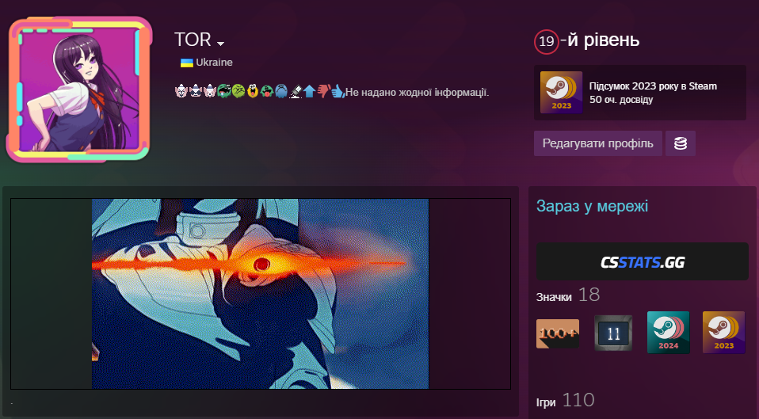

# CSStats.gg Extension for Millennium

A Millennium plugin that integrates CSStats.gg data and functionality directly into the Steam client, providing enhanced Counter-Strike statistics and profile information.

## 📋 Prerequisites

Before installing this plugin, ensure you have:

### Required Software

-   **Steam Client** (Windows/macOS/Linux)
-   **[Millennium](https://steambrew.app/)** installed and configured
-   **Node.js** (version 16 or higher) with **pnpm** package manager
-   **Python 3.7+** with pip

### System Requirements

-   Steam must be installed in a standard location
-   Sufficient permissions to modify Steam plugin directory
-   Internet connection for downloading dependencies and CSStats.gg data

### Example



---

## 🚀 Installation Guide

### Method 1: Pre-built Release (Recommended)

1. **Download the latest release**

    - Go to the [Releases page](https://github.com/TOR968/csstats-extension/releases)
    - Download the `CSStats Extension Plugin.zip` file

2. **Extract the plugin**

    ```bash
    # Windows
    # Extract to: C:\Program Files (x86)\Steam\plugins\csstats-extension

    # Linux
    # Extract to: ~/.local/share/millennium/plugins/csstats-extension

    # macOS
    # Extract to: ~/Library/Application Support/millennium/plugins/csstats-extension
    ```

3. **Enable the plugin**
    - Restart Steam completely (close from system tray)
    - Open Steam and go to **Millennium** → **Plugins**
    - Find "CSStats.gg Extension" and enable it
    - Restart Steam again

### Method 2: Build from Source

#### Step 1: Clone the Repository

```bash
git clone https://github.com/TOR968/csstats-extension.git
cd csstats-extension
```

#### Step 2: Install Dependencies

**Install Node.js dependencies:**

```bash
# Install pnpm if you haven't already
npm install -g pnpm

# Install project dependencies
pnpm install
```

**Install Python dependencies:**

```bash
# Windows
pip install -r requirements.txt

# Linux/macOS
pip3 install -r requirements.txt
```

#### Step 3: Build the Plugin

**For development:**

```bash
pnpm run dev
```

**For production:**

```bash
pnpm run build
```

#### Step 4: Install to Steam

**Option A: Copy to plugins directory**

```bash
# Windows
copy /R . "C:\Program Files (x86)\Steam\plugins\csstats-extension"

# Linux
cp -r . ~/.local/share/millennium/plugins/csstats-extension

# macOS
cp -r . ~/Library/Application\ Support/millennium/plugins/csstats-extension
```

**Option B: Create symbolic link (for development)**

```bash
# Windows (run as Administrator)
mklink /D "C:\Program Files (x86)\Steam\plugins\csstats-extension" "%CD%"

# Linux/macOS
ln -s "$(pwd)" ~/.local/share/millennium/plugins/csstats-extension
```

#### Step 5: Enable Plugin in Steam

1. Completely close Steam (including system tray)
2. Restart Steam
3. Go to **Millennium** → **Plugins**
4. Enable "CSStats.gg Extension"
5. Restart Steam once more

---

## 📖 Release

For detailed release instructions, see [RELEASE.md](RELEASE.md).

---

## 📄 License

This project is licensed under the MIT License - see the [LICENSE](LICENSE) file for details.

---

## 🔗 Links

-   [Millennium Framework](https://github.com/SteamClientHomebrew/Millennium)
-   [CSStats.gg](https://csstats.gg)
-   [Steam Client](https://store.steampowered.com/about/)
